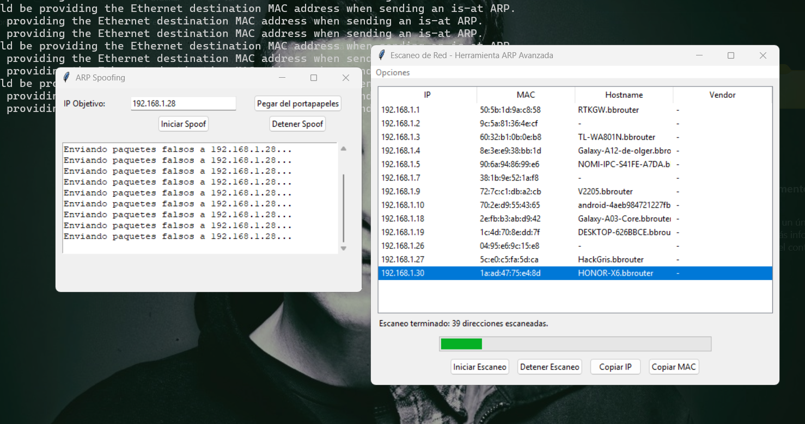

# 🔍 Herramienta ARP Scanner & Spoofer (Windows)

Este proyecto es una herramienta educativa para realizar escaneo de red local y ataques ARP spoofing desde una interfaz gráfica en **Windows**.

> ⚠️ **Advertencia**: Esta herramienta es solo para fines educativos o de auditoría en redes propias. No la uses en redes que no te pertenecen.

---

## 🖥️ ¿Qué hace esta herramienta?

1. **Escaneo de Red (ARP Scan)**  
   Detecta todos los dispositivos conectados a tu red local, mostrando:
   - Dirección IP
   - Dirección MAC
   - Nombre del dispositivo (hostname)
   - Marca del dispositivo (vendor)

2. **ARP Spoofing (MITM)**  
   Permite redirigir el tráfico entre un dispositivo de la red y el router (MITM), útil para:
   - Análisis de paquetes con Wireshark.
   - Pruebas de seguridad interna.

---

## 📷 Interfaz

La interfaz es simple e intuitiva. Aquí una vista previa:



---

## 📦 Requisitos para desarrolladores (modo código)

### 1. Instalar Python

Asegúrate de tener **Python 3.10 o superior**:  
🔗 [https://www.python.org/downloads/](https://www.python.org/downloads/)

Durante la instalación, marca **"Add Python to PATH"**.

### 2. Instalar dependencias

En la consola (CMD o PowerShell), dentro del proyecto:

```bash
pip install -r requirements.txt
```
O, si no tienes el archivo requirements.txt, instala manualmente:
```bash
pip install scapy getmac mac-vendor-lookup
```


## 🧰 Alternativas opcionales
Si no deseas usar el escaneo de red desde esta herramienta, puedes usar software externo:

#🔎 Advanced IP Scanner
🔗 [https://www.advanced-ip-scanner.com/es/](https://www.advanced-ip-scanner.com/es/) 

## 🧱 Npcap (para sniffing en modo promíscuo)
Requerido si deseas capturar paquetes con herramientas como Wireshark.
Sitio web: 
🔗 [https://npcap.com/#download](https://npcap.com/#download) 


## 🚀 Ejecutar el proyecto Modo desarrollador
```bash
python gui.py
```

## Modo ejecutable (.exe) para windows
Descarga el archivo ejecutables.rar con los ejecutables listos para Windows:
Descomprime y haz doble clic en gui.exe para iniciar.
🔗 [https://github.com/cuscocode/arp_spoofing/recursos/ejecutables.rar](https://github.com/cuscocode/arp_spoofing/recursos/ejecutables.rar) 


---

## 🛑 Cómo detener el ataque
Haz clic en "Detener Spoof" desde la interfaz. Cerrar la app también detiene todas las operaciones.

## 📌 Notas adicionales
Algunas funciones podrían requerir permisos de administrador.
El spoofing solo redirige el tráfico; usa Wireshark para capturarlo.
Desactiva temporalmente el firewall o antivirus si bloquea la ejecución del EXE.

## 🤝 Licencia
MIT License - Puedes modificar y usar este proyecto libremente con fines educativos.
